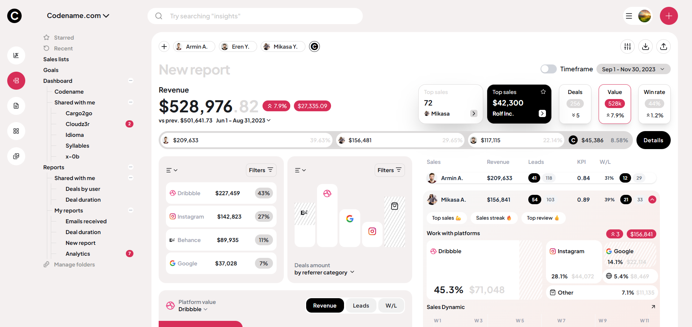

# 📊 Sales Dashboard Assignment

A pixel-perfect replication of a sales analytics dashboard design. 
Built with **React**, **Tailwind CSS**, and custom SVG charting.

🔗 **Live Demo:** [click here](https://acornglobus-assignment.vercel.app/)




## 🛠 Tech Stack
- **Framework:** React (Vite/Next.js)
- **Styling:** Tailwind CSS
- **Icons:** Lucide React, Custom SVG Icons
- **Charts:** Custom CSS/SVG implementation (No heavy charting libraries)

## ✨ Key Features
- **Pixel-Perfect Design:** Matches the reference Figma/Mockup 1:1.
- **Custom Charts:** "Sales Dynamic" and Bar charts built from scratch using SVGs and CSS gradients.
- **Responsive Layout:** Sidebar navigation and adaptive grid system.
- **Clean Code:** Component-based architecture with reusable UI elements.

## 🚀 How to Run Locally

1. Clone the repository
   ```bash
   git clone [https://github.com/your-username/your-repo-name.git](https://github.com/your-username/your-repo-name.git)
   ```

2. Install Dependencies
    ```
      npm install
    ```
3. Start the development server
    ```
    npm run dev
    ```